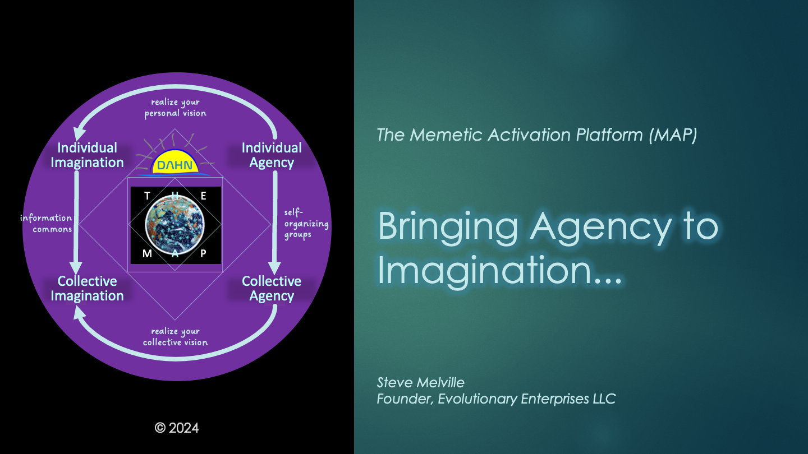

# Orientation: The Memetic Activation Platform (MAP)

## What If?

Can you imagine a software platform — as powerful, sophisticated, and far-reaching as those enjoyed by Fortune 500 corporations —  but created by and for those standing at the forefront of humanity’s evolutionary transformation?

* What might such an architecture look like?
* What would its core characteristics be?
* How might it emerge into being?
* Could it truly serve life rather than extract from it?
* Is meaningful adoption even possible?

The Memetic Activation Platform (MAP) is one response to these inquiries — not a final answer, but a living scaffold for evolutionary experiments in collective flourishing.

MAP is being built for the realities of this moment:

- Deepening ecological and social complexity
- Erosion of trust in centralized systems
- Urgent need for BOTH local autonomy AND planetary coherence

At its heart, MAP helps agents — people, collectives, communities — articulate their values and offers, coordinate through consent-based agreements, and flow vital value across sovereign boundaries.

## ⚠️ Status Update: The MAP is Still Forming — and That’s the Point

The **Memetic Activation Platform (MAP)** is currently in a **proof-of-concept prototyping** phase. Much of what you’ll read here is **in progress** — and that’s intentional. MAP is being built **in the open**, not behind closed doors, because the future it seeks to support depends on collective imagination, critique, and participation.

We’re sharing these ideas now because the **need is urgent**. The systems we’ve inherited are unraveling faster than new ones are taking root. Rather than wait for a perfect blueprint, MAP offers a **generative scaffold** — a pattern language, a protocol layer, a design philosophy — to support those already acting in service to life. Some components are already prototyped; others remain conceptual. But every part is **open for remix**.

If you sense the need for a deeper shift — in how we coordinate, share, govern, and belong — this is your invitation: not to consume a product, but to help shape an **evolving ecosystem**.

## What is the MAP?

The **Memetic Activation Platform (MAP)** is being designed and developed to become a living, decentralized coordination platform that enables people, communities, and ecosystems to **organize, act, and evolve** based on shared values, mutual trust, and regenerative flows of value.

At its core, MAP is an open-ended, open source, decentralized, ecosystem architecture. It provides lightweight but powerful capabilities:

- **I-Spaces**: Personal sovereign spaces where agents cultivate identity, LifeCode, knowledge stewardship, and promise weaving.
- **Agent Spaces**: Relational membranes where collective stewardship, Vital Capital flows, and dynamic governance evolve.
- **Membranes**: Living edges—not rigid walls—that hold identities, agreements, and permeable relationships.
- **Promises and Vital Capital Flows**: The lifeblood of regenerative exchange, woven through explicit, living agreements.
- **Notification Sovereignty**: Empowering each traveler to steward attention and information on their own terms.

Surrounding these core elements, MAP enables five mutually reinforcing ecosystems:

- **Global Meme Pool**: A federated network of knowledge commons.
- **Global Service Registry**: A federated network of service offerings — a gateway for discovering and contributing regenerative apps, services, artistry, consulting, and more. It reflects the full spectrum of gifts that MAP participants bring to life.
- **Empowered Agents Holarchy**: A fractal web of autonomous, interdependent agents and commons.
- **Vital Capital Commons**: Federations of land, water, and cultural stewardship beyond market-state dependency.
- **Visualizer Commons**: Tools for seeing relationships, flows, governance health, and ecosystem dynamics.

**MAP does not push at you.**  
It invites you to pull what resonates—aligned memes, aligned services, aligned communities. No ads. No attention-capturing algorithms that attempt to turn you into the product.

Everything you do—curating your _[Data Grove](/understanding-the-map/appendices/glossary/#data-grove)_, weaving _[Promises](/understanding-the-map/appendices/glossary/#promise)_, _[Offers](/understanding-the-map/appendices/glossary/#offer)_, and _[Agreements](/understanding-the-map/appendices/glossary/#agreement)_, contributing to _[Meme Pools](/understanding-the-map/appendices/glossary/#meme-pool)_, activating _[Agent Spaces](/understanding-the-map/appendices/glossary/#agentspace)_—roots your imagination into action, sovereignty into [stewardship](/understanding-the-map/appendices/glossary/#stewardship), individuality into collective thriving.

## ✧ Travelers on the MAP ✧

You are not a *user*. The MAP is not an app. And you are not here to consume.

"User" is a term borrowed from software and drug markets — a label that flattens complexity, implying subordination to a system, a product, or an experience. It reduces you to a function: input-output, engagement metrics, behavioral data.

But the MAP is not here to use you — it’s here to **amplify you**.

You are a **Traveler**: a sovereign being on a living journey of discovery, creation, and becoming. Some Travelers move with clear intent, charting their way with the stars of memory, desire, or vision. Others wander, improvising, feeling for the rhythm of the Dance. The MAP does not direct your path — it listens, adapts, and reflects. It offers terrain, companions, and invitations. It meets you where you are, and evolves with you as you go.

To be a Traveler is to step into your I-Space with care, extend Offers with purpose, and enter the Dance with presence. It is to recognize that this is not a system to use — but a field to move through, shape, and be shaped by.

**Travelers do not extract value. They create it. Together.**

You are a co-creator of the ecosystem itself.

**_MAP brings agency to imagination._**  
Not once, but again and again, in a living cycle.

**Welcome.**

