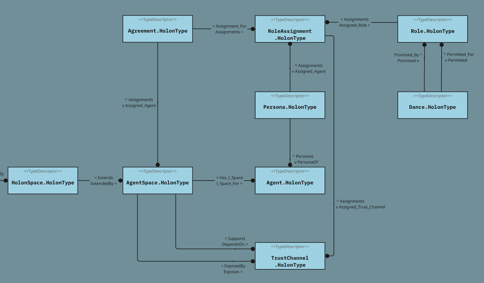

# MAP Schema Definitions (skeletal)



## 🧩 HolonTypes

| **HolonType**      | **Description**                                                                                                                                                                                                                                                                                                                          |
|--------------------|------------------------------------------------------------------------------------------------------------------------------------------------------------------------------------------------------------------------------------------------------------------------------------------------------------------------------------------|
| **Agent**          | Any entity capable of sensing and responding to its environment. It may be biological (e.g., a person, whale, or tree), technical (e.g., a computing process), or social (e.g., a family, cooperative, or commons).A sovereign holon capable of making, evaluating, and keeping Promises. Agents can be individuals, groups, or systems. |
| **Persona**        | A cryptographic proxy identity for an Agent, with its own keypair. Personas act as the public-facing participants in Agreements and Roles.                                                                                                                                                                                               |
| **Agreement**      | A shared commitment between Agents (via Personas), usually granting membership and rights within a Space.                                                                                                                                                                                                                                |
| **Role**           | A named pattern of responsibility or capability within an Agreement, possibly linked to Promised or Permitted Dances.                                                                                                                                                                                                                    |
| **RoleAssignment** | Links a Persona to a Role within a specific Agreement, indicating participatory promises.                                                                                                                                                                                                                                                |
| **HolonSpace**     | A general-purpose container holon that defines a boundary for Holons. All Spaces in the MAP are HolonSpaces.                                                                                                                                                                                                                             |
| **AgentSpace**     | A membraned HolonSpace for agents and interactions. May be an I-Space (HAS_I_SPACE) or a We-Space (if unanchored) (a.k.a., Space).                                                                                                                                                                                                       |
| **Dance**          | A unit of action that can be invoked in a Space, typically governed by a Promise from one Role to another.                                                                                                                                                                                                                               |
| **TrustChannel**   | A TrustChannel is a membrane-bound communication interface, owned by an Agent, that acts in a specific Role within a specific Agreement. It is executed by the Agent’s ComputingNodes and inherits its authority via a RoleAssignment.                                                                                                   |
|


## 🔁 RelationshipTypes

| **Relationship Name** | **Source Type**  | **Target Type** | **Description**                                                                                                                | **Inverse Name**         |
|-----------------------|------------------|-----------------|--------------------------------------------------------------------------------------------------------------------------------|--------------------------|
| **ASSIGNED_AGENT**    | RoleAssignment    | Persona         | The Persona acting in a Role within an Agreement                                                                               | ASSIGNMENTS              |
| **ASSIGNED_ROLE**     | RoleAssignment    | Role            | Indicates the Role the Persona is fulfilling                                                                                   | ASSIGNMENTS              |
| **IN_AGREEMENT**      | RoleAssignment    | Agreement       | Indicates the Agreement the RoleAssignment is part of                                                                          | ASSIGNMENTS              |
| **CONTEXT_SPACE**     | Agreement         | AgentSpace      | Indicates the Space in which the Agreement is valid or applied                                                                 | AGREEMENTS               |
| **PROMISED_DANCE**    | Role              | Dance           | Indicates a Dance the Role promises to perform                                                                                 | PROMISED_BY              |
| **PERMITTED_DANCE**   | Role              | Dance           | Indicates a Dance the Role is permitted to request                                                                             | PERMITTED_TO             |
| **HAS_I_SPACE**       | Agent             | AgentSpace      | Declares that a Space is the private I-Space of an Agent                                                                       | IS_I_SPACE_OF            |
| **PERSONA_OF**        | Persona           | Agent           | Declares the sovereign Agent a Persona belongs to                                                                              | PERSONAS                 |
| **HOME_SPACE**        | Holon             | Space           | Declares the canonical home Space for a given Holon                                                                            | HOME_FOR                 |
| DEPENDS_ON            | AgentSpace   | TrustChannel    | The AgentSpace relies on this TrustChannel to communicate with the outside world via a subagent.                               | SUPPORTS                 |
| EXPOSES               | AgentSpace   | TrustChannel    | This TrustChannel is visible and accessible at the AgentSpace's membrane boundary.                                             | EXPOSED_BY               |
| ASSIGNMENTS           | TrustChannel | RoleAssignment  | This TrustChannel is authorized to play the role assigned via this assignment. | ASSIGNED_TRUST_CHANNELS` |

### Validation Rules

### 🔒 MAP TrustChannel Validation Rules

| **Rule ID**                                      | **Scope**        | **Description**                                                                                                                                                  | **Formal Constraint**                                                                                                                                      |
|--------------------------------------------------|------------------|------------------------------------------------------------------------------------------------------------------------------------------------------------------|-------------------------------------------------------------------------------------------------------------------------------------------------------------|
| `trust-channel-assignments-must-share-agent`     | `TrustChannel`   | All `RoleAssignment`s that assign this `TrustChannel` must reference the same `Persona` as their `ASSIGNED_AGENT`.                                              | ∀ ra₁, ra₂ ∈ RA_TC, A(ra₁) = A(ra₂)<br>or equivalently:<br> |{ A(ra) | ra ∈ RA_TC }| = 1                                                                |
| `trust-channel-exposed-by-owning-agentspace`     | `TrustChannel`   | The `AgentSpace` that exposes this `TrustChannel` must be the same as the one assigned to the Agent that the channel’s `Persona` belongs to.                   | If RA.ASSIGNED_TRUST_CHANNEL = TC,<br> P = RA.ASSIGNED_AGENT,<br> A = P.PERSONA_OF,<br> then TC.EXPOSED_BY = A.ISPACE_FOR                                  |

### 📘 Glossary for Formal Expressions

| **Symbol / Variable** | **Meaning**                                                              |
|-----------------------|--------------------------------------------------------------------------|
| `TC`                  | A `TrustChannel` being validated                                         |
| `RA`                  | A `RoleAssignment` that references the `TrustChannel`                    |
| `RA_TC`               | The set of all `RoleAssignment`s such that `ASSIGNED_TRUST_CHANNEL = TC` |
| `A(ra)`               | The `ASSIGNED_AGENT` (a `Persona`) of a given `RoleAssignment` `ra`      |
| `P`                   | A `Persona` that is the `ASSIGNED_AGENT` of a `RoleAssignment`           |
| `A`                   | The `Agent` that `P` is a `PERSONA_OF`                                   |
| `S_actual`            | The `AgentSpace` that `EXPOSES` the `TrustChannel` (`TC.EXPOSED_BY`)     |
| `S_expected`          | The `AgentSpace` that `ISPACE_FOR` the `Agent` `A` (`A.ISPACE_FOR`)      |


## 🛡️ Privacy Architecture: How Personas Protect Agents

MAP introduces **Personas** as a cryptographic buffer between Agents and their actions. This is essential to maintaining sovereignty and defeating correlation-based surveillance.

---

### 🔍 The Problem: Correlation Tracking

Without separation of identities:
- All RoleAssignments point directly to the Agent
- Patterns of participation across spaces can be observed
- Behavioral, temporal, and network linkages enable tracking
- Agents are exposed to unwanted inference and profiling

---

### 🧬 The Solution: Personas

| **Concept** | **Explanation** |
|-------------|-----------------|
| **Persona** | A proxy identity with its own signing and encryption keys |
| **Agent** | A sovereign holon who controls one or more Personas |
| **Separation** | A Persona is the public actor; the Agent remains private |

---

### 🔁 Relationship Flow

```
Agent
  └── PERSONAS → Persona
        └── ASSIGNED_AGENT ← RoleAssignment
              ├── IN_AGREEMENT → Agreement
              └── ASSIGNED_ROLE → Role
```

---

### ✅ Privacy Benefits

| **Property**                 | **Enabled by Personas** |
|------------------------------|--------------------------|
| Contextual identity          | ✅ Scoped to each space or purpose |
| Unlinkability                | ✅ No shared identifier between Personas |
| Behavior isolation           | ✅ Participation graphs remain disjoint |
| Revocable presence           | ✅ Personas can be retired independently |
| Private agency               | ✅ Agents stay hidden unless they choose to reveal themselves |

---

### 🔐 Cryptographic Design

- **Signing keypair**: used to authenticate promises and requests
- **Encryption keypair**: used to receive private messages
- **No link** to Agent’s master key or other Personas
- **All delegation and disclosure is Agent-controlled**

---

### 🌐 Summary

> **Agents do not act directly in the MAP.**  
> **Personas are their emissaries — modular, revocable, and unlinkable.**  
> This makes MAP a platform where **privacy and agency are mutually reinforcing**.

# MAP Spaces

| **Space Type** | **Agentic?** | **Owned?** | **Contains Agents?** | **Acts as We-Space?**             |
|----------------|--------------|------------|----------------------|-----------------------------------|
| **I-Space**    | ❌ No         | ✅ Yes      | ✅ Optional           | ✅ Yes (if it has sub-agents)      |
| **We-Space**   | ❌ No         | ❌ No       | ✅ Yes                | ✅ Yes                             |
| **Root Space** | ❌ No         | ❌ No       | ✅ Yes                | ✅ Yes (for all agents and spaces) |

## 🧮 Mathematical Functions and Relationships in MAP Schema Context

Let:

- `a` be an **Agent**
- `p` be a **Persona**
- `s` be a **Space**
- `g` be an **Agreement**
- `r` be a **Role**
- `d` be a **Dance**
- `ra` be a **RoleAssignment**
- `h` be a **Holon**

---

### 🧩 Core Functions and Logical Predicates

| **Notation** | **Meaning** |
|--------------|-------------|
| `M(s)`       | The set of Agents who are **members of** Space `s` |
| `C(s)`       | The set of Holons **contained in** Space `s` (via `HOME_FOR`) |
| `V(a, s)`    | Predicate: Agent `a` is **visible in** Space `s` |
| `I(a, s)`    | Predicate: Agent `a` has **interaction rights** in Space `s` |
| `St(a, h)`   | Predicate: Agent `a` is a **steward of** Holon `h` |

These are **derived semantics** built on schema relationships.

---

### 🔁 Mapped to Schema Relationships

#### Persona System

- `p PERSONA_OF → a`  
  (*Each Persona belongs to one Agent*)
- `a PERSONAS → p₁...pₙ`  
  (*Each Agent may have multiple Personas*)

#### Role Participation

- `ra ASSIGNED_AGENT → p`
- `ra ASSIGNED_ROLE → r`
- `ra IN_AGREEMENT → g`

#### Agreement Context

- `g CONTEXT_SPACE → s`  
  ⇒ **Derived Membership Rule**:
  ```
  If:
    ra.ASSIGNED_AGENT = p
    ∧ p.PERSONA_OF = a
    ∧ ra.IN_AGREEMENT = g
    ∧ g.CONTEXT_SPACE = s

  Then:
    a ∈ M(s)
  ```

#### Space Anchoring (I-Space)

- `a HAS_I_SPACE → s`
- `s IS_I_SPACE_OF → a`

#### Holon Location

- `h HOME_SPACE → s`
- `s HOME_FOR → h`

---

### 🎭 Role Capability Model

- `r PROMISED_DANCE → d`  
  (*Role `r` promises to perform Dance `d`*)
- `r PERMITTED_DANCE → d`  
  (*Role `r` is permitted to request Dance `d`*)

---

### 📌 Notes

- Membership, Visibility, and Interaction are **derived states**, not directly stored
- `M(s)` is dynamically constructed from **RoleAssignments**
- `V(a, s)` and `I(a, s)` depend on:
    - Membrane rules
    - Role-based permissions
    - Explicit visibility declarations

---

#### 🧠 Summary of Key Relations

| Concept         | Notation   | Meaning                                               |
|-----------------|------------|-------------------------------------------------------|
| **Membership**  | `a ∈ M(s)` | Agent `a` is a member of space `s`                    |
| **Containment** | `s₁ ⊂ s₂`  | Space or holon `s₁` is structurally contained in `s₂` |
| **Visibility**  | `V(a, s)`  | Agent `a` is visible in space `s`                     |
| **Interaction** | `I(a, s)`  | Agent `a` can act in space `s`                        |
| **Stewardship** | `St(a, h)` | Agent `a` is steward of holon `h`                     |

> **Note**: Membership is inherited, visibility is membrane-gated, interaction is Promise-based, and stewardship is explicitly granted.