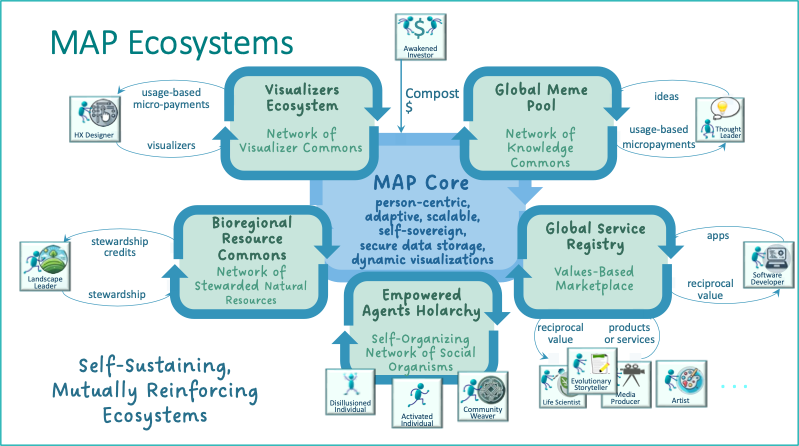

# 🌐 MAP Ecosystems: Self-Sustaining, Mutually Reinforcing Domains

---

## 🌐 What the MAP Makes Possible

The MAP can best be understood, not by what it is, but by the **ecosystems it enables**.

Before diving into the architectural components — Holons, Promises, Offers, Agreements, AgentSpaces, and more — let’s step back and look at the **kinds of systems the MAP exists to support**.

Because MAP isn’t just a protocol. It’s a platform for evolving regenerative culture — one that helps Agents, communities, and bioregions coordinate around what matters most: care, trust, stewardship, creativity, and meaning.

To anchor that vision, this next section introduces **five interdependent ecosystems** that the MAP is designed to nourish:

| Ecosystem                   | Purpose                                                        | Key Flows                             |
|----------------------------|----------------------------------------------------------------|---------------------------------------|
| **Empowered Agents Holarchy** | Enable sovereign identity, agency, and coordination        | Spaces, LifeCodes, Offers, Agreements |
| **Global Meme Pool**         | Curate shared values, patterns, and cultural DNA             | Memes, Rituals, Cultural Remixing     |
| **Global Service Registry**  | Discover, extend, and fulfill service promises               | Offers, Agreements, Service Activation|
| **Global Visualizer Pool**   | Dynamically render experiences across the MAP                | Visualizers, DAHN Personalization     |
| **Natural Resource Commons** | Steward shared ecological flows and assets                  | Resources, Spatial Areas, Stewardship |

Each ecosystem becomes a **self-reinforcing cycle of value**, strengthening itself and the broader MAP through feedback loops of trust, service, visibility, and meaning.

The diagram above shows these five core ecosystems orbiting the MAP Core — the shared infrastructure for person-centric, sovereign, adaptive coordination. Let’s take a closer look.

---

---

### 🧬 Empowered Agents Holarchy

> A federated holarchy of living social organisms —  
> emerging from shared values, mutual trust, and collective intent.

This is where MAP becomes more than a coordination platform —  
it becomes the **scaffolding for new forms of collective life**.

As aligned intentions cohere into shared contexts, new kinds of groups, communities, and bioregional alliances begin to emerge. These are not just human networks — but living configurations of **biological, technological, human, and social agents** acting together in service to place, purpose, and planetary health.

What emerges is:

- **Neighborhood-scale mutual aid networks**
- **Regenerative villages and food webs**
- **Bioregional stewardship councils**
- **Commons-based cooperatives and federations**
- **Cultural and ecological organisms** capable of sensing and acting as one

Each carries:

- A coherent purpose or pattern — a shared memetic signature
- The ability to make commitments, coordinate flows, and evolve over time
- The capacity to act as an **agent in its own right** — in social, economic, ecological, and digital realms
- And critically: **data sovereignty at every level**  
  — each Agent and AgentSpace governs its own data, its own flows, and its own permissions

> Just as membranes define living cells,  
> sovereign data membranes define MAP’s social organisms.  
> Nothing flows without consent. Nothing is exposed without trust.

These organisms may steward land, hold rituals, share knowledge, manage water, govern digital infrastructure, or care for communities of people, species, and technologies alike.

The holarchy itself becomes:

- A **living nervous system** for social, ecological, and technological coherence
- A pattern of **nested sovereignty** — where trust is held locally, and agency is amplified globally
- A space for new forms of ritual, identity, governance, and belonging to emerge — all grounded in **consensual, trustable data flows**

> From the inside out and the bottom up,  
> **multi-species, multi-scale life systems** come into being —  
> capable of sensing, deciding, and acting in symbiotic alignment with life.

\
---

## 🎨 Visualizer Commons

> A decentralized ecosystem of human experience designers — shaping how we *see* and *feel* the MAP.

The Visualizer Commons enables Agents and communities to build and share **visual renderers** — tailored ways of experiencing the MAP’s holons and spaces. Rather than a single, top-down UI, MAP supports pluralism: timelines, ritual views, graphs, immersive journeys, dashboards, and more.

These visualizations are:
- Modular and swappable
- Voted on and adopted through use
- Creatable by anyone — HX designers, ritualists, developers

Each time a visualizer is used, it can generate **usage-based micro-payments**, creating a regenerative loop for creators.

---

## 🧠 Global Meme Pool

> A federated network of knowledge commons —  
> where values, patterns, principles, and coordination templates are curated, composted, and re-expressed.

The Global Meme Pool is the MAP’s deep cultural substrate —  
a shared space for the ideas that **matter enough to align around**.

Much of the cultural territory we need to navigate is uncharted.Accordingly, evolutionary thought leaders, artists and storytellers can help "paint" the MAP with descriptions of the
cultural territory they envision (i.e., they can steward new memes): new governance models, new types of reciprocal value flow agreements, new framings of the concept of money, emerging and re-discovered practices for managing the commons, re-generative agriculture, circular economies, etc.

Explorers and practitioners relying on those descriptions can then put those memes to use, report on their effectivness, and suggest refinements. This will lead to refinements in the descriptions and, for some, growing communities of practice. Accurate descriptions of memes proven to be effective in practice are rewarded by increased adoption. What doesn't work subsides. Arguing is largely unnecessary -- if you think you have a better idea, put it on the MAP and let the evolutionary process decide.

It is not a marketplace of opinions. It is a **federated commons of meaning** —  
a place where:

- Values can be named and shared
- Promises can be patterned and reused
- Offers and Agreements can draw on tested structures
- Communities can declare what they stand for
- New ideas can emerge, adapt, and spread — without losing nuance

### What lives here?

The Meme Pool contains:
- **LifeCode fragments** — values, principles, goals, visions
- **Classification Schemas** — ways of organizing memes into dimensions like values, topics, principles, or rituals
- **Alignment Signals** — badges, tags, or scaffolds that help agents recognize shared commitments
- **Promise Types** — reusable commitment structures (e.g., “presence signal,” “data sharing under consent,” “reciprocal care exchange”)
- **Offer Templates** — role-based configurations that can be adapted to different contexts
- **Models** -- alternative economic models, governance models, models of money and currency, agricultural models, sustainability models, etc.
- **Ontologies** -- type descriptors for property types, relationship types, holon types, and dance types.

### Why it matters

In complex, pluralistic ecosystems, alignment isn’t about **agreement on everything** — it’s about **shared vocabulary, shared patterns, and shared intent**.

The Meme Pool enables:

- **Cultural clarity** across differences
- **Semantic coherence** across agreements
- **Recombinable coordination structures** that evolve over time
- **Memetic certification** — lightweight ways to signal alignment without central authorities

> Just as DNA enables complex life to evolve from simple patterns,  
> the Meme Pool enables cultural complexity to emerge from shared, remixable parts.

### What’s different here?

- Memes are not attention-seeking fragments — they are **structural building blocks** of trust, identity, and coordination
- Memes are **owned by no one**, but **stewarded** by those who care for their clarity, integrity, and evolution
- Every meme can carry provenance, version history, and community endorsement
- Communities can form their own **Meme Pools**, which link into the larger network

> The Global Meme Pool doesn’t seek to unify belief.  
> It scaffolds **coherence without uniformity** —  
> enabling diverse actors to build together in shared meaning.

---

## 🧠 Global Meme Pool

> A network of curated values, patterns, and idea structures — the MAP’s cultural DNA.

The Global Meme Pool is where shared **Promise Types**, **LifeCode patterns**, and **Offer Templates** live. It gives participants:
- A way to align around common principles
- A reference set of proven coordination patterns
- A substrate for memetic certification and value expression

Contributions to the Meme Pool (by thought leaders, pattern keepers, etc.) enable:
- Clarity and reuse in Offers and Agreements
- Alignment across diverse actors
- New forms of **composting ideas into shared capital**

This pool powers both cultural coherence and innovation.

---

## 🛠 Global Service Registry

> A trust-aware, value-aligned marketplace of services, apps, and capacities.

The Service Registry enables Agents to discover **services** — whether offered by individuals, groups, or applications. But unlike conventional marketplaces, it is:
- Role- and Promise-aware
- Governed through Agreements
- Filtered by LifeCode compatibility, trust level, or membrane policy

Services can range from digital APIs to in-person rituals. When registered through MAP:
- They integrate into DAHN
- They become discoverable based on need and context
- They generate **reciprocal value flows** (not just financial)

Developers and service providers participate not by competing for attention, but by aligning with purpose.

---

## 🌱 Bioregional Resource Commons

> Localized stewardship of land, water, ecosystems, and place-based capital.

This ecosystem supports the creation of **Commons-based coordination around natural resources**. It helps:
- Track Vital Capital flows like water, carbon, biodiversity, etc.
- Connect ecological thresholds with service delivery and economic flows
- Allocate **stewardship credits** to those regenerating shared assets

Agents like landscape stewards and bioregional networks use the Commons to:
- Define regenerative thresholds
- Coordinate contributions and care
- Receive compensation or recognition tied to ecological health

The Bioregional Commons localizes the global, turning planetary care into everyday practice.

## ♻️ The Flywheel Effect

Each ecosystem reinforces the others:

- The **Meme Pool** gives language to Offers and Agreements
- The **Service Registry** operationalizes them
- The **Visualizer Commons** makes them intelligible and beautiful
- The **Bioregional Commons** roots them in living systems
- The **Agent Holarchy** turns them into durable social structures

Together, they form a **self-sustaining architecture** for cultural evolution.

> MAP is not just about digital interaction. It’s about building the regenerative flywheels of a new planetary culture.

---

Let me know if you'd like this styled for a dedicated “Ecosystems” page, embedded as contextual callouts, or abbreviated into a sidebar or tour format.