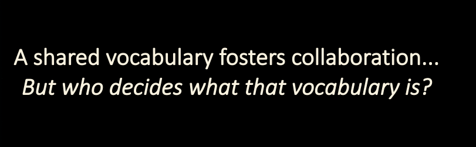

# 🧠 Grammar of Meaning

---

## 🧬 Meaning as Cultural Infrastructure

At the heart of any coordinated action is **shared meaning** — a common understanding of values, intentions, patterns, and distinctions. Without this, no agreement holds, no service lands, and no relationship endures.

The **MAP’s Global Meme Pool** provides the infrastructure for **memetic coordination**: the evolution and stewardship of meaning across diverse agents, cultures, and scales.

Here, **memes** are not internet jokes or ideological slogans. They are **living building blocks of cultural DNA** — representing:

- Principles
- Values
- Patterns
- Distinctions
- Commitments
- Coordination structures
- Semantic scaffolds

They are held, evolved, and expressed through **relational participation** — not through ownership, but through **stewardship**.

---

## 📚 What Is a Meme in MAP?

> A **Meme** is a cultural unit — a named idea, distinction, or pattern — capable of being referenced, stewarded, expressed, and evolved.

Memes may be simple labels (like `#consent` or `#bioregionalism`), complex frameworks (like Ostrom’s Principles), or structured coordination models (like a specific governance scaffold).

Memes can:

- Be **included in MemeGroups**
- Participate in **MemePlexes** (clusters that spread well together)
- Be **expressed in books, rituals, or diagrams**
- Be **exhibited** or **inhibited** by agents (via LifeCode / MemeticSignature)
- Be linked to other memes through **named, definitional relationships**

> These links form a **web of meaning** — the **semantic layer** of MAP — which evolves through consent, use, and stewardship.

---

## 🔍 Semantic vs Semiotic Layers

MAP distinguishes between:

| Layer        | Description                                                                | Examples                                                |
|--------------|----------------------------------------------------------------------------|---------------------------------------------------------|
| **Semantic** | The *meaning* of a meme — its relationships, principles, and distinctions  | “Solidarity” as a value, defined in a Meme              |
| **Semiotic** | The *expression* of that meme — how it shows up in language, images, media | A poem, badge, ritual, or video expressing “Solidarity” |

A single meme may have many semiotic expressions. These can be:

- Private (notes, annotations)
- Shared (comments, explanations)
- Referenced (in Agreements, Offers, or LifeCodes)
- Never modified — memes themselves are **immutable** once defined

---

## 🌱 A Local-First, Stewarded Web of Meaning

Meaning doesn’t start global. It starts local — in one agent’s I-Space.

### Agents can:
- **Reference** an existing meme
- **Annotate** it with local context
- **Derive** a new meme from it (additive only)
- **Propose** new meanings to stewardship groups

Meme **stewardship** happens in a *StewardshipSpace* — a group of agents caring for a meme (or meme group). They:

- Review proposed changes
- Release new versions
- Publish selected memes to one or more **ReferenceSpaces** (e.g. PlanetarySpace)

Each version of a meme includes:
- A **semantic version number** (Patch / Minor / Major)
- A **transitive closure of definitional relationships** — this *is* what defines that version’s meaning

---

## 🌀 The Role of Memetic Signatures

> Every Agent in the MAP carries a **Memetic Signature** — a set of memes they consciously exhibit or inhibit.

Memetic Signatures are how agents express identity, alignment, and intent.  
They power:

- **LifeCodes**
- **Offer alignment**
- **Trust channels**
- **Cultural resonance**

A Memetic Signature is not a brand. It’s a living declaration of **what you stand for, what you steward, and what you seek**.

---

## 🔄 How Meaning Evolves in MAP

MAP supports a collaborative grammar for **memetic evolution**:

1. **Reference** — Start with an existing meme
2. **Derive** — Create an additive variant in your I-Space
3. **Push** — Submit your derived meme to a StewardshipSpace (via a Pull Request)
4. **Govern** — Stewards evaluate, discuss, and accept/reject changes
5. **Release** — Accepted memes receive new semantic versions
6. **Publish** — Selected memes are made available to ReferenceSpaces

There is **no central authority** for meaning.  
Just nested membranes, additive derivation, and consentful publishing.

This allows:

- **Forking and rejoining** of memetic threads
- **Parallel proposals** without merge conflicts
- **Cultural coherence** without uniformity

---

## 🛠 The Grammar, Not the Content

> “MAP doesn’t tell you what to believe.  
> It gives you a place to **name, share, remix, and align** what you find meaningful.”

The Grammar of Meaning enables:

- Durable definitions without coercion
- Clear provenance and semantic stability
- Open-ended creativity within communal integrity

It’s not a marketplace of opinions.  
It’s a **commons of care** — where ideas are not owned, but grown.

---

## ✅ Summary: Meaning as a Commons

| Element                               | Role                                               |
|---------------------------------------|----------------------------------------------------|
| **Meme**                              | A named unit of cultural meaning                   |
| **MemeGroup / MemePlex / MemeFamily** | Ways to organize and relate memes                  |
| **MemeticSignature**                  | What an Agent exhibits or inhibits                 |
| **StewardshipSpace**                  | Where memes are governed and evolved               |
| **ReferenceSpace**                    | Where memes are published and made available       |
| **Versioning**                        | Reflects additive or breaking semantic changes     |
| **Pull Requests**                     | Allow new proposals to be considered for inclusion |

> **MAP turns culture into a composable protocol.**  
> It makes shared meaning iterable, stewarded, and remixable —  
> so that agents across differences can align in motion.

---

## 📎 See Also

- Appendix: *Grammar of Meaning – Protocol Specification*  
  (for developers, stewards, and governance designers)

- Section: *Global Meme Pool Ecosystem*  
  (for narrative introduction to memes, stewards, and memetic flows)