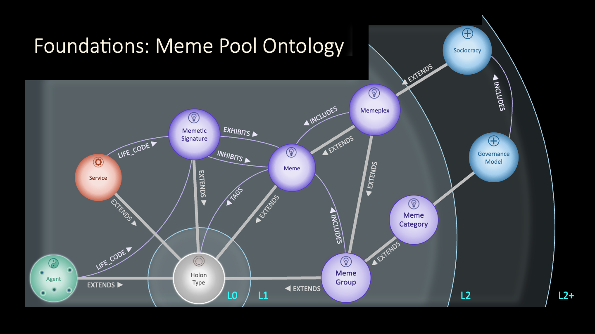
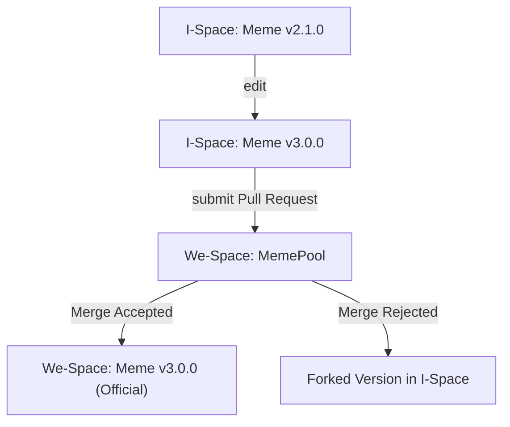

# Global Meme Pool


## MAP Foundations -- the Core Meme Schema (L1)

The **L1 Ontology for Memes** establishes the foundational types and relationships that underpin the Global Meme Pool. It defines the minimal holonic structures required to represent memes, their groupings, and their roles in expressing, transmitting, and stewarding meaning across the MAP ecosystem.




---

### 🧬 1. Core Type — `Meme`

**Extends:** `HolonType`  
**Description:** A self-describing cultural unit — an idea, symbol, or practice — capable of replication, mutation, and recombination through human or agentic interaction.  
**Minimal Definition:** A label or “hashtag” that can classify any holon.  
**Purpose:** To provide the lightest-weight semantic affordance for attaching meaning or discoverability across the MAP.

**Key Relationships:**
- `TAGS` → `HolonType` — any holon can be tagged with memes
- `STEWARDED_BY` → `Agent` — the meme’s steward
- `EXPRESSED_IN` → `VitalCapital` — links to the meme’s expressions (e.g., books, podcasts, videos)
- `EXHIBITED_BY` / `INHIBITED_BY` ← `MemeticSignature` — links to the values or tendencies an agent embodies

---

### 🧩 2. Derived Types

#### **`MemeticSignature`**
**Extends:** `HolonType`  
**Description:** The composite pattern of memes that constitute an agent’s or space’s LifeCode — indicating which memes are exhibited and which are inhibited.

**Relationships:**
- `EXHIBITS` → `Meme`
- `INHIBITS` → `Meme`
- `EXHIBITED_BY` / `INHIBITED_BY` ← `Agent` (via LifeCode)

---

#### **`MemeGroup`**
**Extends:** `Meme`  
**Description:** A curated collection of memes grouped for organizational or thematic purposes, without implying shared replication dynamics.  
**Relationships:**
- `INCLUDES` → `Meme`
- `REMOVES` → `Meme`
- `GROUPED_BY` ← `MemeGroup`

---

#### **`Memeplex`**
**Extends:** `MemeGroup` (and therefore also `Meme`)  
**Description:** A self-reinforcing cluster of memes that replicate more effectively together than separately.  
**Examples:** Ostrom’s Eight Principles, ProSocial Core Design Principles, MAP Foundational Rules.  
**Relationships:**
- `INCLUDES` → `Meme`
- `PART_OF` ← `Memeplex` (supports nested composition)

Because a Memeplex is itself a Meme, it can be **exhibited or inhibited** by MemeticSignatures — allowing whole memeplexes to function as single memetic units.

---

#### **`MemeFamily`**
**Extends:** `Meme`  
**Description:** A conceptual grouping of **alternative** memes within a shared domain — from which an agent or space typically selects one (e.g., governance models).  
**Relationships:**
- `HAS_MEMBER` → `Meme`
- `CHOOSES_FROM` ← `Agent` (via LifeCode or Governance Scaffold)

This captures the “choice among patterns” dynamic without treating the family itself as directly exhibited.

---

### 🔗 3. Integration Across MAP

| **Aspect**               | **Integration Point**             | **Rationale**                                    |
|--------------------------|-----------------------------------|--------------------------------------------------|
| **Governance Scaffolds** | `APPLIES_PRINCIPLES` → `Memeplex` | Prosocial and Ostrom principles modeled as memes |
| **LifeCode / Identity**  | `LifeCode.EXHIBITS` → `Meme`      | LifeCodes express MemeticSignatures              |
| **Promise Weaves**       | `GovernanceScaffold` → `Memeplex` | Shared memetic context grounds agreements        |
| **Vital Capital**        | `EXPRESSED_IN` → `VitalCapital`   | Connects memes to cultural expressions           |
| **Agent Spaces**         | `STEWARDED_BY` → `AgentSpace`     | Every meme belongs to one stewarded meme pool    |

---

### 🧭 4. Design Philosophy

- **Minimal Ontological Commitment** — provides expressive tagging without premature constraint.
- **Progressive Semantic Enrichment** — meanings deepen through use and relational context.
- **Holonic Consistency** — every meme (and meme collection) is both a whole and part, supporting recursive memetic ecologies.
- **Alignment with Vital Capital & Promise Layers** — memes define *meaning*, promises define *action*, and vital capital defines *flow*.

---

### 🪶 5. Visual Summary

```
HolonType
  └── Meme
       ├── MemeGroup
       │     └── Memeplex
       └── MemeFamily
  └── MemeticSignature
          ├── EXHIBITS → Meme
          └── INHIBITS → Meme
```

---

### ✅ 6. Summary

The **Core Meme Schema (L1)** provides a minimal yet extensible scaffold for the Global Meme Pool.  
It supports open-ended creativity while enabling coherent mapping of values, meanings, and cultural codes across MAP.  
Memes serve as the foundational “units of meaning” through which regenerative coordination becomes intelligible, evolvable, and shareable at every scale.

---

### 🧬 7. Memetic Merge Protocol — A Git-Like Pattern for Meme Evolution

To evolve memes collaboratively, MAP supports a protocol of **autonomous development → federated convergence**, inspired by Git but tuned for social semantics.

#### 🧠 Agent-Centric Meme Evolution

- **I-Space** is like a local Git repo — Agents check out memes and freely experiment.
- **We-Spaces** are shared Meme Pools — structured coordination venues where contributions are reviewed, merged, or branched.
- Each meme has a **semantic boundary** defined by its **transitive definitional relationships**.

#### 🧩 Change Classification — Semantic Versioning

| Change Type | Description |
|-------------|-------------|
| **Patch** | Adding optional metadata or non-definitional relationships |
| **Minor** | Relaxing constraints, extending but not redefining meaning |
| **Major** | Tightening constraints, removing elements, or adding new definitional relationships |

Changes propagate up through the definitional graph — a major change in a child holon results in a major bump to the root meme version.

---

#### 🔁 Pull Requests as Merge Proposals

A `PullRequest` is a proposal from an Agent to merge their version of a meme into a We-Space:

```json
{
  "type": "MemeMergeProposal",
  "proposed_by": "Agent:alice",
  "from_space": "I-Space:alice",
  "to_space": "We-Space:ProSocialMemes",
  "base_version": "meme:v2.1.0",
  "proposed_version": "meme:v3.0.0",
  "change_summary": [
    { "type": "major", "description": "Added new governance constraint" },
    { "type": "minor", "description": "Relaxed role cardinality" }
  ],
  "supersedes": "meme:v2.1.0",
  "merge_strategy": "review-and-approve",
  "status": "PendingReview"
}
```

---

#### 🛡 Merge Governance

Each We-Space (MemePool) defines a `ResolutionPolicy`, such as:

- `trust-based-auto-merge`
- `semver-gated`
- `review-and-approve`
- `vote-based`

Merge holons track decisions and forks if consensus isn't reached.

---

#### 🧠 Supporting Holon Types

| Type | Purpose |
|------|---------|
| `MemeBranch` | Represents alternate development paths |
| `PullRequest` | Tracks the proposed merge and its metadata |
| `MergeResolution` | Documents the outcome of a merge process |
| `ResolutionPolicy` | Defines governance logic per MemePool |

---

#### 🌳 Visual Lifecycle




---

#### ✅ Result: A Social Version Control for Meaning

This protocol supports:

- Autonomous creativity in private I-Spaces
- Shared semantic clarity in public We-Spaces
- Policy-driven merge workflows
- Traceable lineage of memetic meaning

It turns **cultural evolution** into a **deliberate, consensual, and composable process**.

---