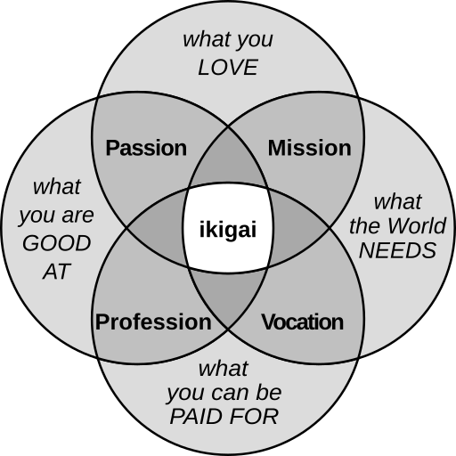

# 🌅 **Promise Weaves and Ikigai**
### *How MAP turns the search for purpose into a participatory feedback system*

Ikigai is often described as the sweet spot where what you love, what you’re good at, what the world needs, and what sustains you converge.  
But in practice, Ikigai is hard to find because our cultural systems rarely give us clear, honest, or reciprocal feedback.

The **Promise Weave Protocol** in MAP changes this by creating a **living relational membrane** that actively reflects back:

- what is needed in a space
- where your gifts align
- where mutual nourishment is possible
- where resonance and reciprocity form naturally

In other words:  
**MAP operationalizes Ikigai as a dynamic, emergent pattern grounded in real relationships.**

Below is the structural mapping.

---

# 🔶 1. “What You Love” ↔ LifeCode Resonance
Your **LifeCode** expresses your values, intentions, and the deeper qualities that animate you.

When you emit an Enquiry or an Offer, MAP uses your LifeCode to:

- filter for alignment
- surface resonant spaces
- reveal where your passions find a home

The Promise Weave becomes a **memetic tuning fork**, showing you where what you love truly belongs.

---

# 🔶 2. “What You’re Good At” ↔ Gift Promises & Skill Affordances
Your contributions in MAP are expressed through Promises:

- Service Offers
- Skill contributions
- Time or care commitments
- Capital flows you’re willing to steward

When a Promise is quickly accepted, or repeatedly sought, the Weave mirrors back:

- where your gifts land
- where you are relied upon
- where your competence shapes outcomes

The Weave becomes a **relational competence mirror**.

---

# 🔶 3. “What the World Needs” ↔ Needs Promises & Connection Space Signals
In MAP’s connection spaces, what circulates are:

- expressed needs
- missing roles
- unmet capital flows
- LifeCode-aligned requests

This creates **direct, honest visibility** into what a space truly needs.  
You no longer have to guess.

You simply see the invitations that are alive in the system.

The world speaks its needs clearly — and you respond.

---

# 🔶 4. “What Sustains You” ↔ Vital Capital Flows & Thresholds
Ikigai must be sustainable.

Every Promise in MAP includes explicit **Vital Capital flows**:

- What you give
- What you receive
- Under what conditions
- With what renewability
- With what thresholds
- With what reciprocity

MAP continuously reveals:

- where you are nourished
- where you are depleted
- where your participation is regenerative
- where overextension emerges
- where mutuality thrives

This is Ikigai as **ecological self-awareness**.

---

# 🌀 5. Ikigai as Emergence ↔ The Promise Weave Itself
Ikigai is not deduced.  
It *emerges* in the intersection of passion, gifts, needs, and sustenance.

A Promise Weave automatically models:

- memetic alignment
- trust channels
- capital reciprocities
- role coherence
- governance fit
- sustainability quotients
- flow balance
- relational interdependence

**Your Ikigai becomes the center-of-gravity of your Promise Weaves.**

---

# 🪢 6. Collective Ikigai ↔ Shared LifeCodes & Emergent Purpose
Groups also have Ikigai — a collective purpose that arises from:

- aggregated LifeCodes
- intersecting Promises
- shared unmet needs
- stabilized flows
- compatible governance
- emergent resonance

A Promise Weave becomes the **collective purpose field** of an emerging AgentSpace.

Purpose is no longer declared.  
It is *co-sensed*.

---

# 🌳 7. Why the Promise Weave Makes Ikigai Easier
Because it offers:

- **Direct feedback** on where you are needed
- **Real resonance** with your values
- **Nourishment visibility** through capital flows
- **Gift mirroring** through accepted Offers
- **Safe membranes** for meaningful participation
- **Adaptive evolution** as you grow
- **Nested purpose** across multiple spaces

MAP turns Ikigai from a solitary search into a **relational discovery process**.

---

# 🌟 8. Core Insight
💡 **Ikigai is not a static identity.  
It is a dynamic relational pattern.**

The Promise Weave Protocol gives that pattern:

- real signals
- real flows
- real resonance
- real reciprocity
- real nourishment
- real emergence

MAP doesn’t just help you find Ikigai.  
It **makes Ikigai a living, evolving experience** felt through relationship, reciprocity, and regenerative collaboration.

---